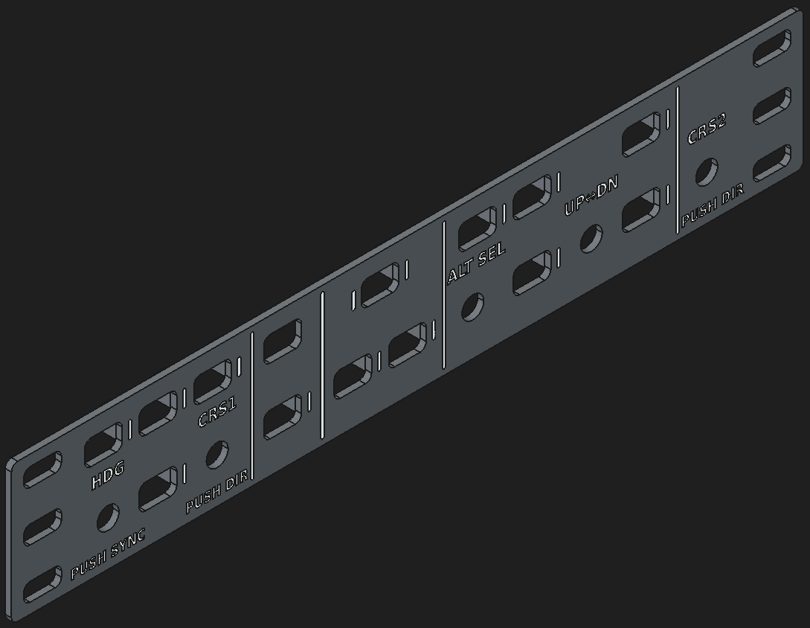
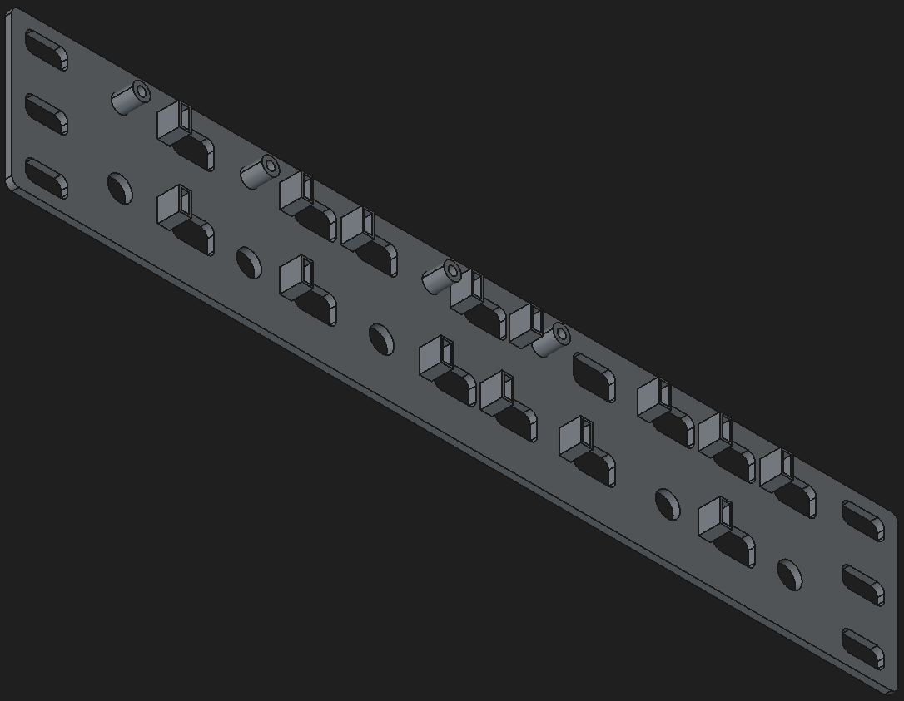
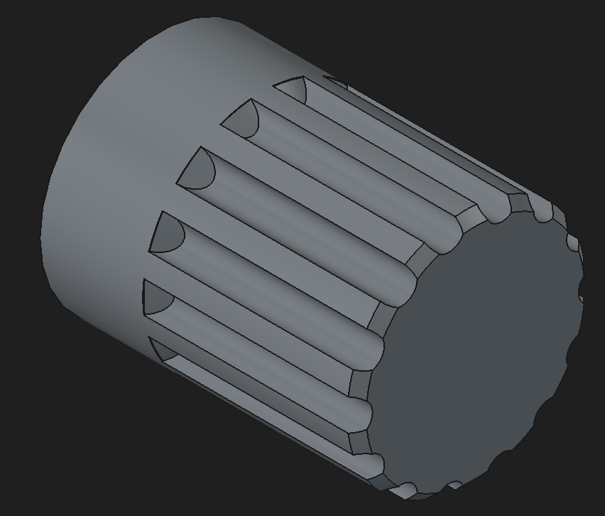
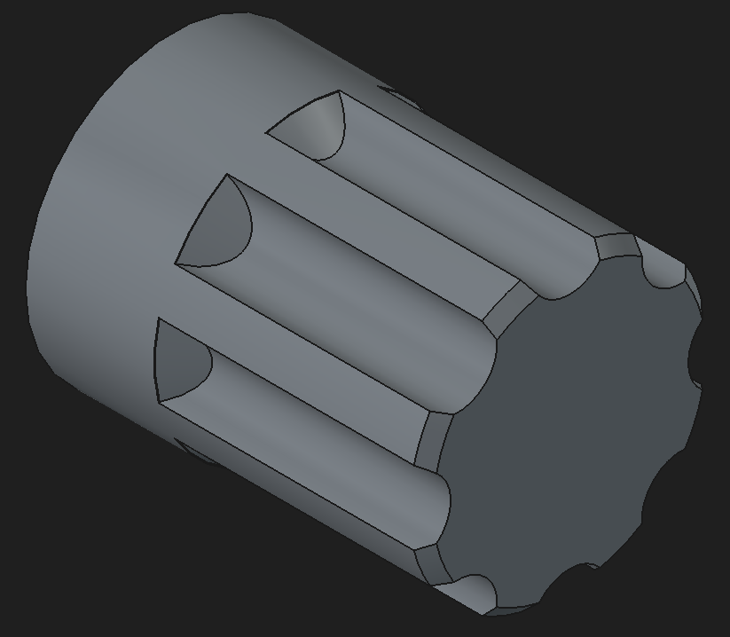
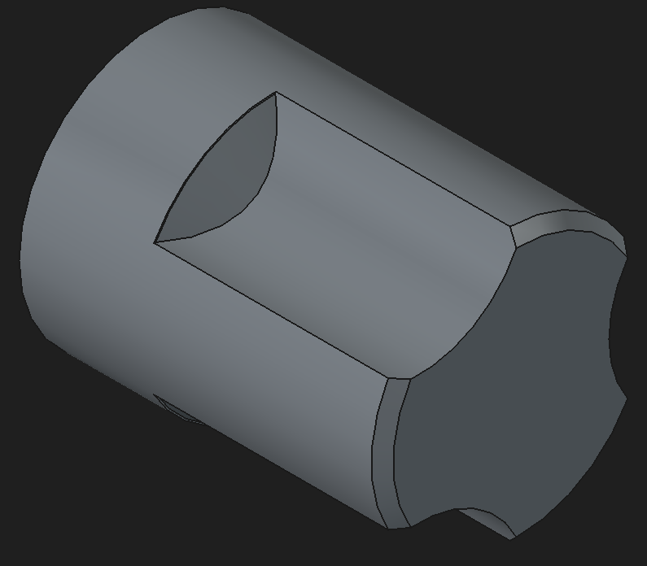
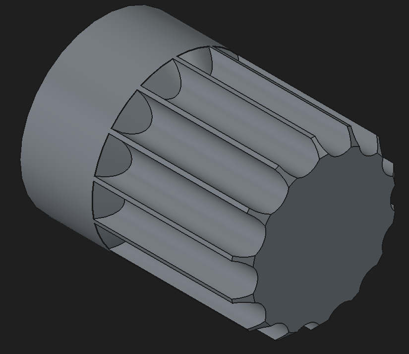

# Gremlin APC 710

## Faceplate

| Front View | Rear View |
| --- | --- |
|  |  |
| Front of the APC 710 faceplate model showing control and mounting geometry. | Rear of the APC 710 faceplate model showing backside structure and clearances. |

The FreeCAD 3D model for the APC 710 faceplate is contained in [CAD/gremlin_apc_710_faceplate.FCStd](../CAD/gremlin_apc_710_faceplate.FCStd). It is built as a parametric part based in a variable set and can serve as the base for the creation of similar autopilot instruments.

A 3D printer-ready STEP file is provided at [CAD/gremlin_apc_710_faceplate.step](../CAD/gremlin_apc_710_faceplate.step). The faceplate fits completely in a 220 x 220 mm print bed and can be split in a suitable slicer to fit in smaller print areas. No supports are needed.

The Step file is set up for multi-material printing, but in such a way that it can be printed in mono-material printers. The coloured labels are 0.2 mm thick, which can be used as the layer height. Print the labels first, excecute a manual filament change and continue the print. For some printers, this procedure can be semi-automated in the slicer.

## Knobs

| ALT Knob | CRS Knob |
| --- | --- |
|  |  |
| ALT selector knob geometry. Source: [CAD/alt_knob.FCStd](../CAD/alt_knob.FCStd). | CRS selector knob geometry. Source: [CAD/crs_knob.FCStd](../CAD/crs_knob.FCStd). |

| HDG Knob | UP/DN Knob |
| --- | --- |
|  |  |
| HDG selector knob geometry. Source: [CAD/hdg_knob.FCStd](../CAD/hdg_knob.FCStd). | UP/DN knob geometry. Source: [CAD/att_knob.FCStd](../CAD/att_knob.FCStd). |

4 different knob designs are used to allow for the tactile identification of the different knob functions. The knobs are designed to be printed with the top of the knob against the print plate and the hole side facing up, this allows printing with no supports. The inner diameter of the mounting hole has been sized for a sliding fit in the encoders, accounting for PLA shrinking. Edit according to your material of choice.

## Buttons
